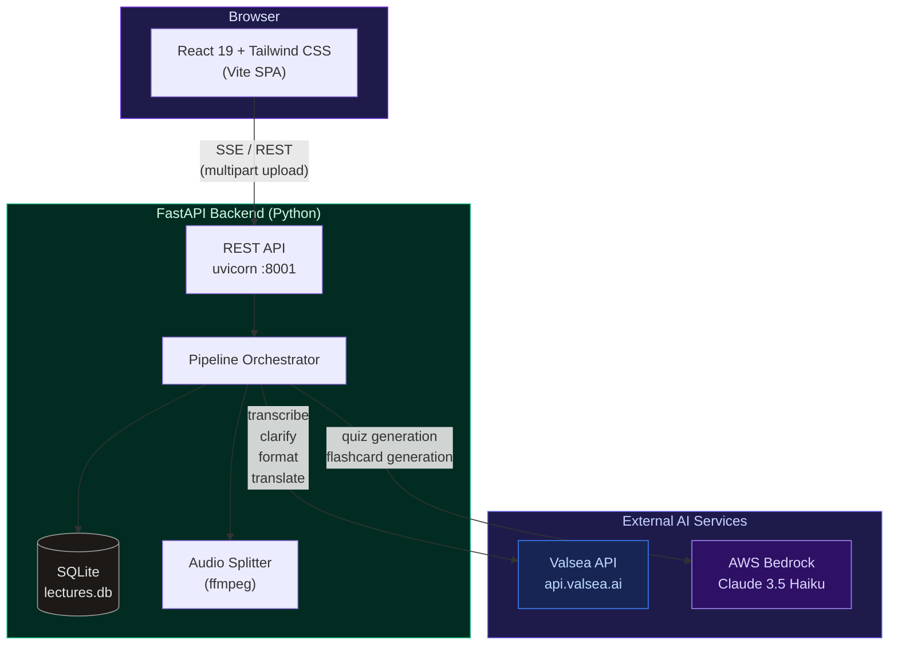
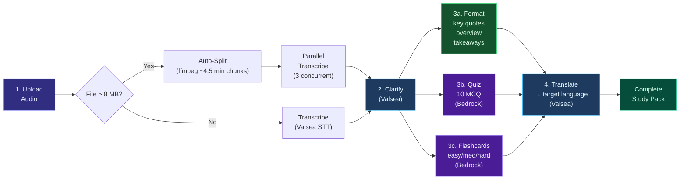
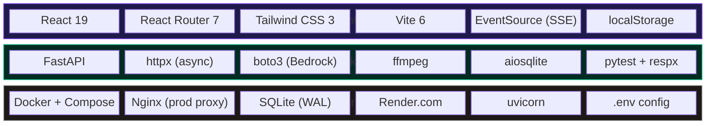
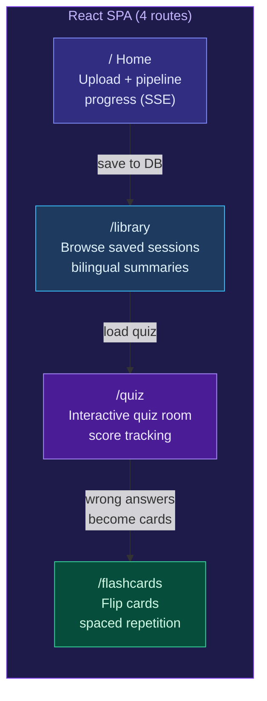
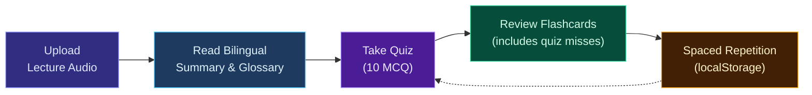
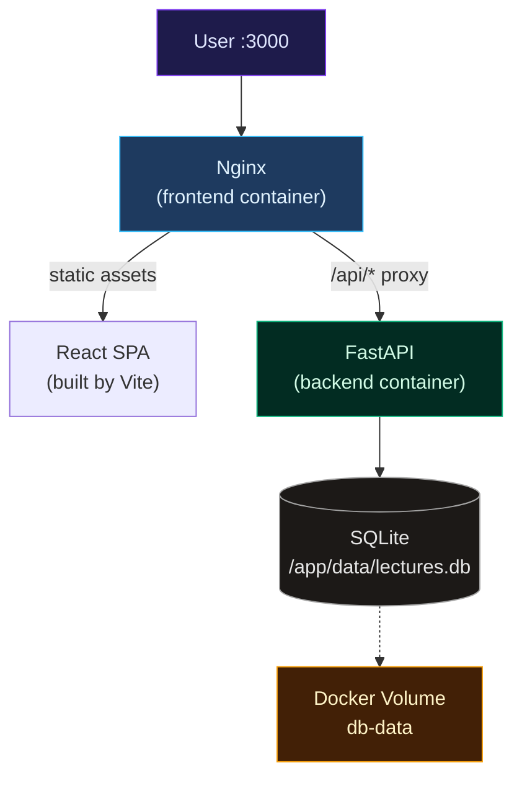

# Lecture2Quiz SEA

**From classroom audio to bilingual study packs.**

Upload a lecture recording — get a clean transcript, bilingual summary, quiz, and flashcards.
Built specifically for **Southeast Asian languages** with accent-aware speech models.

---

## Architecture

### High-Level Overview



### Processing Pipeline

The core of the system is a multi-step async pipeline that transforms raw audio into a complete study pack. Steps 3 (format, quiz, flashcards) run **in parallel** for speed.



### Tech Stack



### Valsea APIs Used

| Endpoint | Model | Purpose |
|----------|-------|---------|
| `POST /v1/audio/transcriptions` | `valsea-transcribe` | Speech-to-text with SEA accent support (70+ languages) |
| `POST /v1/clarifications` | `valsea-clarify` | Clean noisy/colloquial transcript into clear text |
| `POST /v1/formatting` | `valsea-format` | Generate key quotes, overview, action items |
| `POST /v1/translations` | `valsea-translate` | Translate to student's native language |

### AWS Bedrock (Claude)

| Task | Output |
|------|--------|
| Quiz Generation | 10 multiple-choice questions (4 options, correct answer + explanation) |
| Flashcard Generation | Front/back cards with 3 difficulty tiers (easy, medium, hard) |

### Frontend Pages



### Student Study Flow



### Docker Deployment Architecture



### Project Structure

```
VALSEA_PROJECT/
├── backend/
│   ├── main.py                 # FastAPI app — all REST endpoints
│   ├── db.py                   # SQLite CRUD (aiosqlite)
│   ├── services/
│   │   ├── pipeline.py         # Orchestrator: transcribe → clarify → format + quiz → translate
│   │   ├── audio_splitter.py   # ffmpeg auto-split for large files
│   │   ├── transcribe.py       # Valsea STT wrapper
│   │   ├── clarify.py          # Valsea clarification wrapper
│   │   ├── format_summary.py   # Valsea formatting (key_quotes, minutes, action_items)
│   │   ├── translate.py        # Valsea translation wrapper
│   │   ├── quiz.py             # AWS Bedrock quiz generation
│   │   └── flashcards.py       # AWS Bedrock flashcard generation
│   ├── tests/                  # pytest + respx test suite
│   └── requirements.txt
├── frontend/
│   ├── src/
│   │   ├── App.jsx             # React Router setup (4 routes)
│   │   ├── pages/
│   │   │   ├── Home.jsx        # Upload + SSE progress + results tabs
│   │   │   ├── Library.jsx     # Saved lectures browser
│   │   │   ├── Quiz.jsx        # Interactive quiz room
│   │   │   └── Flashcards.jsx  # Flip cards with spaced repetition
│   │   ├── components/
│   │   │   ├── Layout.jsx      # App shell + nav
│   │   │   ├── FlipCard.jsx    # Animated flip card component
│   │   │   └── AnalyticsPanel.jsx
│   │   └── lib/
│   │       ├── api.js          # API helpers + SSE consumer
│   │       ├── studyDeck.js    # Session/quiz state management
│   │       └── textSimilarity.js
│   ├── vite.config.js
│   ├── tailwind.config.js
│   └── package.json
├── Dockerfile                  # Multi-stage: Node build → Python runtime
├── docker-compose.yml          # Backend + Nginx frontend + volume
├── render.yaml                 # Render.com one-click deploy
├── llm.txt                     # Full Valsea API reference
└── .env.example
```

### Key Design Decisions

| Decision | Rationale |
|----------|-----------|
| **Valsea for speech** | Purpose-built for SEA accents & languages — better accuracy than generic STT for Singlish, Vietnamese, Thai, etc. |
| **Bedrock for generation** | Claude 3.5 Haiku is fast & cheap for structured JSON output (quiz/flashcards). Retries handle throttling. |
| **SSE streaming** | Students see real-time progress ("Transcribing chunk 2/5...") instead of a mystery spinner. |
| **Auto-split** | Large lectures (>8 MB) are chunked and transcribed in parallel — transparent to the user. |
| **SQLite (WAL mode)** | Zero-config persistence. Sufficient for single-server deployment. Easily swappable to PostgreSQL. |
| **Adaptive flashcards** | Wrong quiz answers automatically become flashcards — personalized spaced repetition. |
| **Multi-stage Docker** | Single image: Node builds frontend → Python serves everything. Simple deploy anywhere. |

---

## Deploy to the Internet (Render.com — free)

The fastest way to get the app live on a public URL.

### 1. Push code to GitHub

```bash
git add -A && git commit -m "add deployment config"
git push origin main
```

### 2. Deploy on Render

1. Go to [render.com](https://render.com) and sign in with GitHub
2. Click **New +** → **Web Service**
3. Connect your GitHub repo
4. Render auto-detects the `Dockerfile` — just click **Create Web Service**
5. In the **Environment** tab, add your secret keys:
   - `VALSEA_API_KEY` = your Valsea key
   - `AWS_ACCESS_KEY_ID` = your AWS key
   - `AWS_SECRET_ACCESS_KEY` = your AWS secret
   - `BEDROCK_REGION` = `us-west-2` (or your preferred region)
6. (Optional) Under **Disks**, add a 1 GB disk mounted at `/app/data` to persist the SQLite database

Render will build and deploy automatically. Your app will be live at `https://your-app-name.onrender.com`.

> **Note:** The free tier spins down after 15 min of inactivity (first request takes ~30s to wake up). Upgrade to the $7/mo plan to keep it always on.

### Alternative: Railway.app

1. Install the Railway CLI: `npm i -g @railway/cli`
2. Run:
   ```bash
   railway login
   railway init
   railway up
   ```
3. Add environment variables in the Railway dashboard
4. Get your public URL from the dashboard

---

## Deploy with Docker (self-hosted)

Deploy the full app in one command. Requires [Docker](https://docs.docker.com/get-docker/) and [Docker Compose](https://docs.docker.com/compose/install/).

### 1. Clone and configure

```bash
git clone <your-repo-url>
cd VALSEA_PROJECT
cp .env.example .env
```

Edit `.env` with your real keys:

```bash
VALSEA_API_KEY=vl_...
AWS_ACCESS_KEY_ID=AKIA...
AWS_SECRET_ACCESS_KEY=...
BEDROCK_REGION=us-west-2
```

### 2. Build and run

```bash
docker compose up -d --build
```

The app is now live at **http://your-server-ip:3000**.

To use a different port: `PORT=8080 docker compose up -d --build`

### 3. Useful commands

```bash
docker compose logs -f          # View logs
docker compose down             # Stop everything
docker compose up -d --build    # Rebuild after code changes
```

### Deploy to a VPS (DigitalOcean, AWS EC2, etc.)

1. Create a server with Docker installed (Ubuntu 22.04+ recommended)
2. Clone the repo to the server
3. Copy `.env` with your keys
4. Run `docker compose up -d --build`
5. Open port 3000 (or your chosen PORT) in firewall/security group
6. (Optional) Point your domain to the server IP

For HTTPS, add a reverse proxy like [Caddy](https://caddyserver.com/) in front — it handles Let's Encrypt certificates automatically.

---

## Local Development (without Docker)

### Setup

1. Copy env:

   ```bash
   cp .env.example .env
   # Edit .env with your keys
   ```

2. Backend:

   ```bash
   cd backend
   python3 -m venv .venv
   source .venv/bin/activate   # Windows: .venv\Scripts\activate
   pip install -r requirements.txt
   ```

3. Frontend:

   ```bash
   cd frontend
   npm install
   ```

### Run

**Terminal 1 — API:**

```bash
cd backend
source .venv/bin/activate
uvicorn main:app --reload --host 127.0.0.1 --port 8001
```

**Terminal 2 — Frontend (dev server):**

```bash
cd frontend
npm run dev
```

Open **http://localhost:5173** — the Vite dev server proxies API calls to the backend automatically.

## Tests

```bash
cd backend
source .venv/bin/activate
pytest tests/ -q
```

## Auto-split for large audio

Files over 8 MB are automatically split into ~4.5-minute MP3 chunks via `ffmpeg`, transcribed in parallel through Valsea, then recombined. Requires `ffmpeg` on the system PATH (included in Docker image).

| Variable | Default | Purpose |
|----------|---------|---------|
| `SPLIT_MAX_CHUNK_BYTES` | `8388608` (8 MB) | Files larger than this trigger auto-split |
| `SPLIT_CHUNK_DURATION_SECS` | `270` (4.5 min) | Target duration per chunk |
| `PARALLEL_TRANSCRIPTIONS` | `3` | Max concurrent Valsea transcription requests |

## API

| Method | Path | Purpose |
|--------|------|---------|
| GET | `/health` | Liveness check |
| POST | `/process` | Upload audio, get transcript + quiz + flashcards (supports SSE streaming) |
| POST | `/translate` | Batch translate texts |
| POST | `/transcribe-voice` | Transcribe short voice recording |
| GET | `/lectures` | List all lectures |
| GET | `/lectures/{id}` | Get lecture detail |
| DELETE | `/lectures/{id}` | Delete a lecture |
| PATCH | `/lectures/{id}` | Rename a lecture |
| POST | `/lectures/combine` | Combine multiple lectures |
| POST | `/lectures/{id}/generate` | Generate more quiz/flashcards |

## Environment variables

| Variable | Required | Default | Description |
|----------|----------|---------|-------------|
| `VALSEA_API_KEY` | Yes | — | [Valsea API key](https://valsea.ai/en/dashboard/api-keys) |
| `AWS_ACCESS_KEY_ID` | Yes | — | AWS credentials for Bedrock |
| `AWS_SECRET_ACCESS_KEY` | Yes | — | AWS credentials for Bedrock |
| `BEDROCK_REGION` | No | `us-east-1` | AWS region for Bedrock |
| `BEDROCK_MODEL` | No | `anthropic.claude-3-5-haiku-20241022-v1:0` | Bedrock model ID |
| `BEDROCK_CONTEXT_CHARS` | No | `24000` | Transcript chars sent to Bedrock |
| `BEDROCK_QUIZ_MAX_RETRIES` | No | `4` | Retry count for Bedrock throttling |
| `USE_MOCK_QUIZ` | No | `false` | Use mock quiz data (testing) |
| `USE_MOCK_FLASHCARDS` | No | `false` | Use mock flashcard data (testing) |
| `PORT` | No | `3000` | Host port for web app (Docker only) |

## Docs

- Full Valsea reference: [`llm.txt`](llm.txt)
